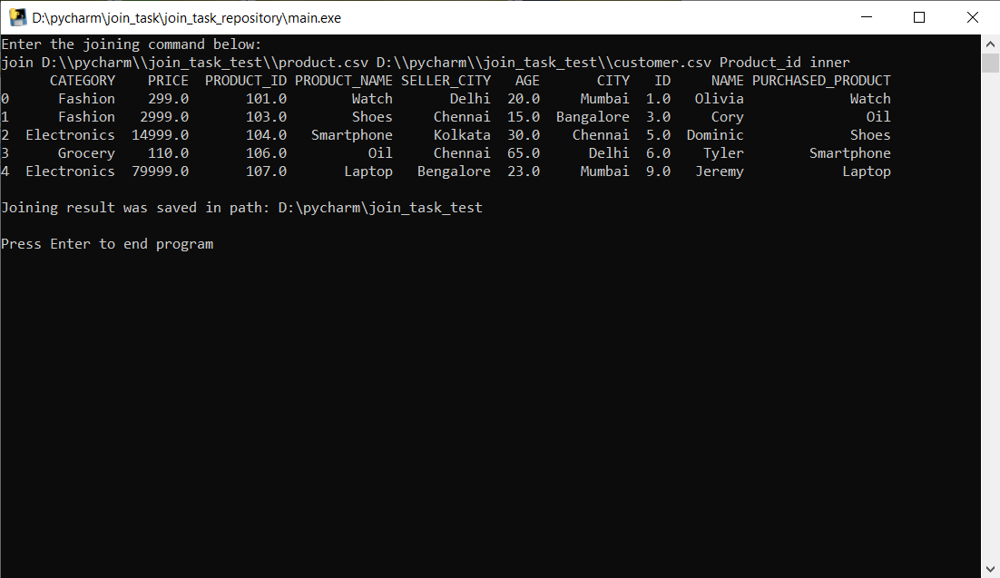

# Join - implementation task
> It's an implementation of join method written in Python

## Table of Contents
* [General Information](#general-information)
* [Technologies Used](#technologies-used)
* [Setup](#setup)
* [Usage](#usage)
* [Screenshot of command window](#screenshot-of-command-window)
* [Acknowledgements](#acknowledgements)

## General Information
It' an executable program, which will: 
- read two csv files,
- join them using a specified column
- write the result to the standard output

Users specify the join type: inner, left or right.

## Technologies Used
- Python - version 3.8.10
- pandas - Python Data Analysis Library - version 1.2.5
- NumPy - version 1.21.4

## Setup
Download main.exe file from repository and run it. It takes a while
before user is able to write initial command.

## Usage
When the program start you see in the command line:

`Enter the joining command below:`

Following this massage, write command by the formula:

`join file_path file_path column_name join_type`

where:
- `file_path` - path to csv file we want to join with
- `column name` - name of the column, which is used for joining
- `join_type` - one of 3 possible join type: inner, left or right

After giving the correct command, joining result is printed
in command window and save in path of first csv file. 

## Screenshot of program window

## Acknowledgements
This program is part of my recruitment process. I am so grateful for
giving me this opportunity to check my skills and improve them.
